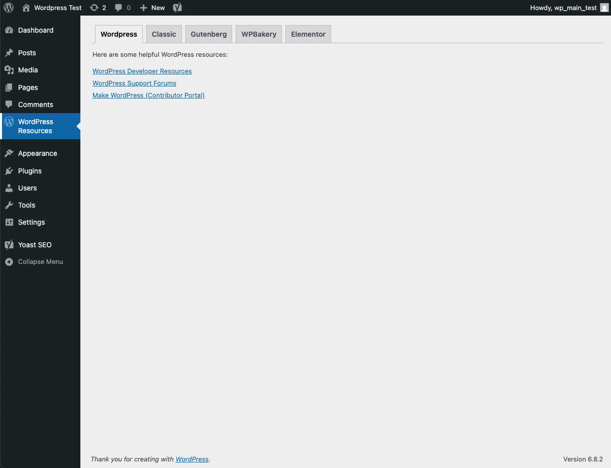

# WordPress Site Builder Resources

## 📖 Description

By Weng Fei Fung. Curated list of WordPress site builder resources directly in your WordPress sidebar. As an agency or freelancer, you may encounter multiple site builders—whether modifying existing websites, choosing a builder plugin, or using a theme built on one. Having a quick refresher on each builder easily accessible can be helpful.

The resources are organized to cover:

- **WordPress (general)**
- **Classic Editor**
- **Gutenberg**
- **WPBakery**
- **Elementor Pro**

Each section includes guides, references, and links to useful documentation.

---

## ⚡ Installation

1. Upload the plugin files to:  
   `/wp-content/plugins/wordpress_sitebuilder_resources/`
2. Or install directly through the **WordPress Plugins screen**.
3. Activate the plugin through the **Plugins screen** in WordPress.
4. Find the **Site Builder Resources** panel in your WordPress sidebar.

---

## ❓ FAQ

### Can I contribute new resources?
Yes! Please feel free to contribute links, tutorials, or documentation. Add them to the relevant section (WordPress, Classic Editor, Gutenberg, WPBakery, or Elementor Pro).  

Repository: [github.com/siphon880gh/wordpress_sitebuilder_resources](http://github.com/siphon880gh/wordpress_sitebuilder_resources)

### Does this plugin add site builder functionality?
No. This plugin is **purely a resource hub**. It does not alter your site builders or their functionality.

---

## 📜 Changelog

### 1.0
- Initial release with resources for WordPress, Classic Editor, Gutenberg, WPBakery, and Elementor Pro.

---

## 🔔 Upgrade Notice

### 1.0
First release — adds a sidebar resource panel for site builders.

---

## 🖼️ Screenshots

1. Sidebar panel showing **WordPress Site Builder Resources**.

---

## 🏷️ Tags
`wordpress resources`, `wordpress site builder tutorials`
